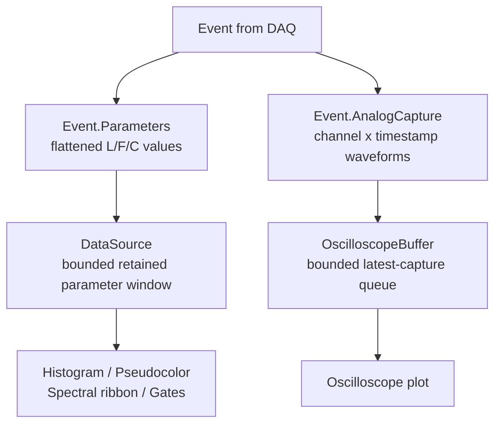
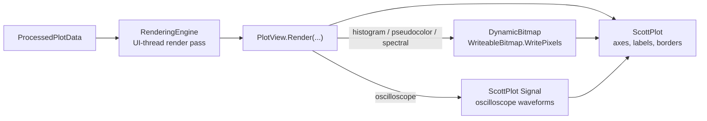

# Worksheet

Worksheet is a `.NET 8` WPF desktop application for building an interactive plotting workspace over a bounded rolling event stream. It combines a freeform drag-and-resize canvas with ScottPlot-based visualizations for histogram, pseudocolor, spectral ribbon, and oscilloscope views.

The app is currently oriented around simulated acquisition through the in-repo `CHASM` pipeline and a channel map loaded from `channels.json`.

## Features

- Interactive worksheet canvas with draggable, resizable plot tiles
- Plot types:
  - Histograms
  - Pseudocolor heatmaps
  - Spectral ribbon views
  - Oscilloscope plots
- Start/stop streaming controls and configurable rolling window size
- Plot gating support with live gate statistics in the sidebar
- Snap-to-grid layout controls
- Bounded in-memory event retention for stable long-running sessions
- Repo-local or user-local file logging for exceptions and diagnostics

## Tech Stack

- `net8.0-windows`
- WPF
- [ScottPlot.WPF](https://scottplot.net/)
- `MathNet.Numerics`

## Repository Layout

- `Worksheet.App/`: WPF application, views, render orchestration, and app startup
- `Worksheet.Core/`: domain models, CHASM acquisition, buffering, processing, gates, and logging
- `Worksheet.Tests/`: focused tests for Core behavior
- `docs/`: architecture notes, audits, coding standards, and research writeups

## Getting Started

### Prerequisites

- Windows
- `.NET SDK 8.0`
- An IDE with WPF support such as Visual Studio 2022 or JetBrains Rider

### Run

```powershell
dotnet restore
dotnet run --project .\Worksheet.App\Worksheet.App.csproj
```

You can also open `Worksheet.sln` in Visual Studio and run the WPF project directly.

## Configuration

The application loads channel metadata from `channels.json` at startup. The project copies both `channels.json` and `channels.example.json` to the output directory.

Typical setup:

1. Copy `channels.example.json` to `channels.json` if you want a local variant.
2. Edit channel names and wavelengths to match your data source.
3. Start the application.

Channel names affect plot labeling and feature selection:

- Histogram and pseudocolor plots use all configured channels.
- Spectral ribbon plots use only numeric wavelength channels.

## Using the App

On launch, the main window is split into:

- A left sidebar for streaming controls, rolling-window size, gate stats, and processing metrics
- A top toolbar for adding plot types, loading the preset worksheet layout, clearing memory, and changing snap-to-grid behavior
- A worksheet area where plots can be moved and resized freely

Common workflow:

1. Start streaming from the sidebar.
2. Add plots from the toolbar.
3. Drag and resize plots on the worksheet.
4. Adjust plot settings from context menus or plot dialogs.
5. Inspect gate stats and processing/render timing in the sidebar.

The `Load Histogram Config` toolbar action currently builds a preset layout with:

- Two configured pseudocolor plots
- One spectral ribbon plot
- A grid of histogram plots for available channels

## Data and Rendering Pipeline

The detailed review document is `docs/INGESTION_PROCESSING_RENDERING_PIPELINE.md`.

At a high level, Worksheet uses this path:

```mermaid
flowchart LR
    Source["DAQ adapter or MockProducer"]
    EventProducer["EventProducer / IEventIngestionPort"]
    Converter["EventBatchConverter"]
    Queue["Channel<IEventBatch>"]
    Consumer["ChasmConsumer"]
    ChasmSource["ChasmDataSource"]
    RawStore["DataSource<br/>rolling raw-event window"]
    Processing["ProcessingEngine<br/>PlotProcessor / GateProcessor"]
    DataStore["DataStore<br/>latest processed data"]
    Rendering["RenderingEngine"]
    Views["PlotViews"]
    Screen["WPF screen"]

    Source -->|"Event objects"| EventProducer
    Source -->|"flat column-major buffers"| EventProducer
    EventProducer -->|"Event.Parameters"| Converter
    Converter -->|"ColumnMajorEventBatch"| Queue
    EventProducer -->|"PublishColumnMajor"| Queue
    Queue --> Consumer
    Consumer --> ChasmSource
    ChasmSource --> RawStore
    RawStore --> Processing
    Processing --> DataStore
    DataStore --> Rendering
    Rendering --> Views
    Views --> Screen
```



The pipeline has two related streams:

- Parameter events are flattened numeric values shaped by `SignalLayout`. They feed histograms, pseudocolor plots, spectral ribbon plots, and gates.
- Analog captures are waveform samples shaped as `[channel, timestamp]`. They feed oscilloscope plots through `OscilloscopeBuffer` and are not stored in the retained event window.



Rendering is split between ScottPlot's static plot frame and app-owned dynamic data layers:



Important semantics:

- `ChasmPipelineFactory.CreateMock(...)` wires simulated acquisition.
- `ChasmPipelineFactory.CreateEventIngress(...)` wires a push-style DAQ boundary and returns an `IEventIngestionPort`.
- `IEventIngestionPort.PublishEvents(...)` accepts object batches and converts `Event.Parameters` into `ColumnMajorEventBatch`.
- `IEventIngestionPort.PublishColumnMajor(...)` accepts already-flat column-major buffers for the fastest no-copy path.
- `Event.AnalogCapture` is routed to `IAnalogCaptureSink` / `OscilloscopeBuffer`, separate from parameter-event storage.
- `DataSource` stores retained parameter values column-wise as `_channels[signalIndex][eventIndex]` in a fixed-capacity ring buffer.
- `SignalLayout.ToIndex(laser, feature, channel)` maps selected Laser/Feature/Channel coordinates to one retained signal column.
- `ProcessingEngine` only recomputes plots when settings, render target size, or data version changes.
- `RenderingEngine` coalesces changed processed data and renders on the WPF UI thread.
- Histogram, pseudocolor, and spectral ribbon plots use a bitmap data layer aligned to the ScottPlot data rectangle.
- `DynamicBitmap.PresentBitmap(...)` blits BGRA pixel buffers into a `WriteableBitmap` with `WritePixels(...)`.
- Oscilloscope plots draw selected waveform channels as ScottPlot signal plottables instead of using the bitmap blit path.

Default mock acquisition settings come from `Worksheet.Core/Services/CHASM/ChasmOptions.cs`:

- Acquisition interval: `25 ms`
- Batch size: `500`
- Window capacity: `200,000` events

## Logging

The app initializes file logging on startup through `Services/AppLog.cs`.

Log directory resolution order:

1. `WORKSHEET_LOG_DIR` environment variable
2. Repo-local `logs/` directory when writable
3. App output `logs/` directory when writable
4. `%LocalAppData%\Worksheet\logs`

## Development Notes

Useful project documents:

- `docs/INGESTION_PROCESSING_RENDERING_PIPELINE.md`: end-to-end explanation from CHASM ingestion through plot processing, rendering, and bitmap blitting
- `docs/CHASM_PIPELINE.md`: acquisition and rolling-window semantics
- `docs/PLOT_PIPELINE_REGISTRY_PLAN.md`: plot-pipeline registry notes for per-plot data sources and cadences
- `docs/PLOT_PIPELINE_AUDIT.md`: current processing/rendering behavior and bottlenecks
- `docs/UI_VISUALIZATION_RESEARCH.md`: background research on low-latency multi-plot visualization
- `docs/CODING_STANDARDS.md`: local coding conventions
- `docs/AI_AGENT_POLICY.md`: repo-specific agent guidance

### Profiling

Focused Core processing profile tests live in `Worksheet.Tests`.

```powershell
dotnet test .\Worksheet.Tests\Worksheet.Tests.csproj --no-restore --filter "Category=Profile" --logger "console;verbosity=detailed"
```

These tests report full-window and delta processing timings for histogram, pseudocolor, and spectral ribbon processing, plus WPF plot-view render-method timings. They do not enforce machine-specific speed thresholds. Render timings measure the app's `PlotView.Render()` paths on an STA thread, not full dispatcher scheduling or monitor frame latency.

For ingestion-only throughput and raw payload bandwidth:

```powershell
dotnet test .\Worksheet.Tests\Worksheet.Tests.csproj --no-restore --filter "FullyQualifiedName~IngestionProfileTests" --logger "console;verbosity=detailed"
```

`IngestionProfileTests.ProfileSnapshotCopyCost` reports the live-versus-copied snapshot cost for one-signal, two-signal, and spectral-width selections.

For real CHASM channel/consumer ingestion throughput:

```powershell
dotnet test .\Worksheet.Tests\Worksheet.Tests.csproj --no-restore --filter "FullyQualifiedName~ChasmPipelineProfileTests" --logger "console;verbosity=detailed"
```

## Current State

This repository appears to be an actively evolving prototype for interactive multi-plot visualization. The core desktop workflow is in place, with current audit notes covering ingestion throughput, live snapshot tradeoffs, incremental processing, bitmap-based rendering, and remaining UI-thread scalability risks.
