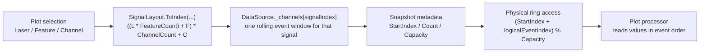
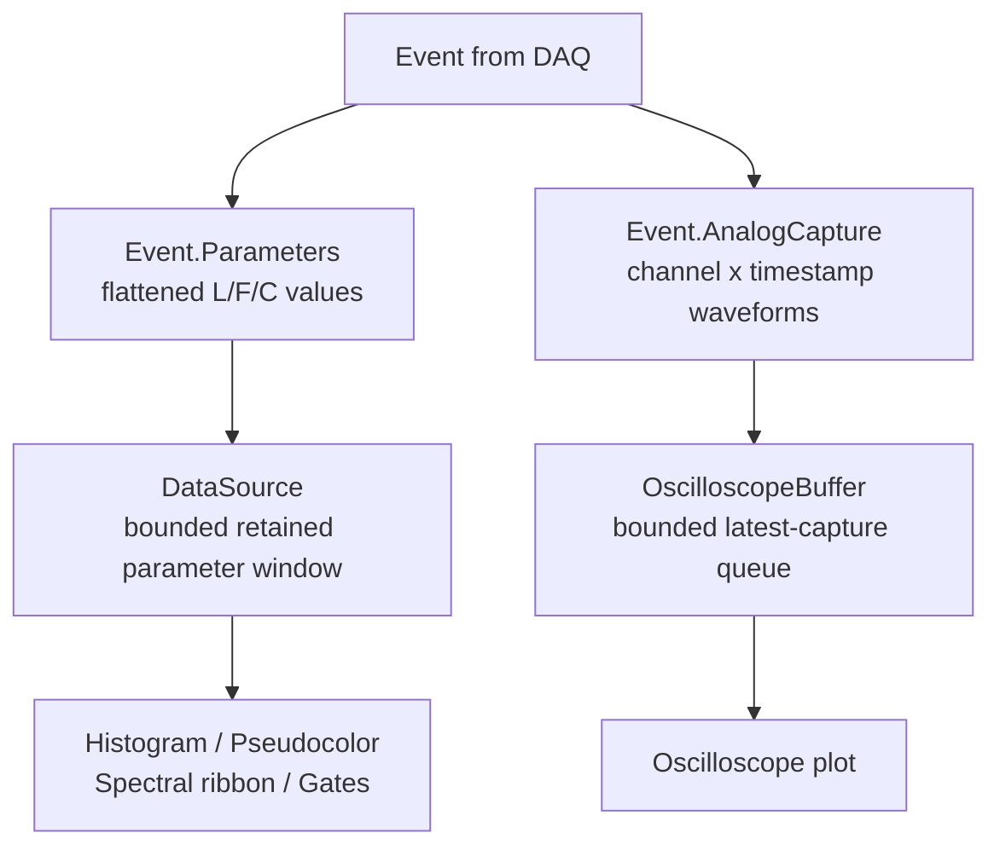
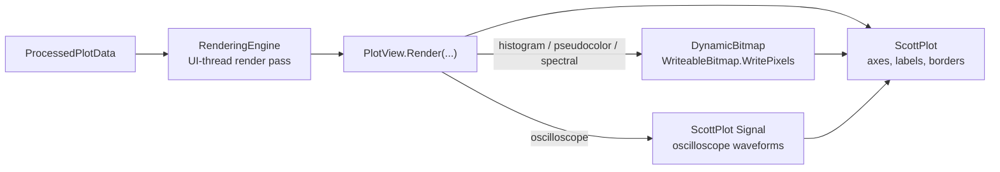

# Worksheet

Worksheet is a `.NET 8` WPF desktop application for building an interactive plotting workspace over a bounded rolling event stream. It combines a freeform drag-and-resize canvas with ScottPlot-based visualizations for histogram, pseudocolor, spectral ribbon, and oscilloscope views.

The app is currently oriented around simulated acquisition through the in-repo `CHASM` pipeline and a channel map loaded from `channels.json`.

## Features

- Interactive worksheet canvas with draggable, resizable plot tiles
- Plot types:
  - Histograms
  - Pseudocolor heatmaps
  - Spectral ribbon views
  - Oscilloscope plots
- Start/stop streaming controls and configurable rolling window size
- Plot gating support with live gate statistics in the sidebar
- Snap-to-grid layout controls
- Bounded in-memory event retention for stable long-running sessions
- Repo-local or user-local file logging for exceptions and diagnostics

## Tech Stack

- `net8.0-windows`
- WPF
- [ScottPlot.WPF](https://scottplot.net/)
- `MathNet.Numerics`

## Repository Layout

- `Worksheet.App/`: WPF application, views, render orchestration, and app startup
- `Worksheet.Core/`: domain models, CHASM acquisition, buffering, processing, gates, and logging
- `Worksheet.Tests/`: focused tests for Core behavior
- `docs/`: architecture notes, audits, coding standards, and research writeups

## Getting Started

### Prerequisites

- Windows
- `.NET SDK 8.0`
- An IDE with WPF support such as Visual Studio 2022 or JetBrains Rider

### Run

```powershell
dotnet restore
dotnet run --project .\Worksheet.App\Worksheet.App.csproj
```

You can also open `Worksheet.sln` in Visual Studio and run the WPF project directly.

## Configuration

The application loads channel metadata from `channels.json` at startup. The project copies both `channels.json` and `channels.example.json` to the output directory.

Typical setup:

1. Copy `channels.example.json` to `channels.json` if you want a local variant.
2. Edit channel names and wavelengths to match your data source.
3. Start the application.

Channel names affect plot labeling and feature selection:

- Histogram and pseudocolor plots use all configured channels.
- Spectral ribbon plots use only numeric wavelength channels.

## Using the App

On launch, the main window is split into:

- A left sidebar for streaming controls, rolling-window size, gate stats, and processing metrics
- A top toolbar for adding plot types, loading the preset worksheet layout, clearing memory, and changing snap-to-grid behavior
- A worksheet area where plots can be moved and resized freely

Common workflow:

1. Start streaming from the sidebar.
2. Add plots from the toolbar.
3. Drag and resize plots on the worksheet.
4. Adjust plot settings from context menus or plot dialogs.
5. Inspect gate stats and processing/render timing in the sidebar.

The `Load Histogram Config` toolbar action currently builds a preset layout with:

- Two configured pseudocolor plots
- One spectral ribbon plot
- A grid of histogram plots for available channels

## Data and Rendering Pipeline

The detailed review document is `docs/INGESTION_PROCESSING_RENDERING_PIPELINE.md`.

At a high level, Worksheet uses this path:

```mermaid
flowchart LR
    Source["DAQ adapter or MockProducer"]
    EventProducer["EventProducer / IEventIngestionPort"]
    Converter["EventBatchConverter"]
    Queue["Channel<IEventBatch>"]
    Consumer["ChasmConsumer"]
    ChasmSource["ChasmDataSource"]
    RawStore["DataSource<br/>rolling raw-event window"]
    Processing["ProcessingEngine<br/>PlotProcessor / GateProcessor"]
    DataStore["DataStore<br/>latest processed data"]
    Rendering["RenderingEngine"]
    Views["PlotViews"]
    Screen["WPF screen"]

    Source -->|"Event objects"| EventProducer
    Source -->|"flat column-major buffers"| EventProducer
    EventProducer -->|"Event.Parameters"| Converter
    Converter -->|"ColumnMajorEventBatch"| Queue
    EventProducer -->|"PublishColumnMajor"| Queue
    Queue --> Consumer
    Consumer --> ChasmSource
    ChasmSource --> RawStore
    RawStore --> Processing
    Processing --> DataStore
    DataStore --> Rendering
    Rendering --> Views
    Views --> Screen
```



CHASM is the ingestion/lifecycle side of the system. The rolling memory buffer is `DataSource`:

```mermaid
flowchart LR
    Chasm["Chasm<br/>start/stop lifecycle"]
    Producer["IProducer<br/>MockProducer or EventProducer"]
    Queue["Channel<IEventBatch><br/>short bounded queue"]
    Consumer["ChasmConsumer<br/>async queue drain"]
    Adapter["ChasmDataSource<br/>batch-layout adapter"]
    Store["DataSource<br/>ROLLING WINDOW MEMORY<br/>_channels[signal][event]<br/>_writeIndex / _count / _windowCapacity"]
    Snapshots["ChannelWindowSnapshot<br/>MultiChannelWindowSnapshot"]
    Processors["PlotProcessor<br/>GateProcessor"]

    Chasm -. "starts/stops" .-> Producer
    Chasm -. "starts/cancels" .-> Consumer
    Chasm -. "sets streaming / window / clear" .-> Adapter
    Producer -->|"IEventBatch"| Queue
    Queue --> Consumer
    Consumer -->|"Append(batch)"| Adapter
    Adapter -->|"AppendBatch(...)"| Store
    Store -->|"GetSnapshot(...)"| Snapshots
    Snapshots --> Processors
```



In code terms:

```text
Chasm           = owns streaming lifecycle
ChasmConsumer   = drains Channel<IEventBatch>
ChasmDataSource = translates EventBatch / ColumnMajorEventBatch into DataSource append calls
DataSource      = owns the fixed-capacity ring buffer and DataVersion
```

The `L/F/C` selection chooses which signal window to read; the rolling-window
metadata chooses which retained events inside that signal are currently visible:



So a selected `Laser/Feature/Channel` does not scan every signal. It maps to one
flattened `signalIndex`, then reads only that signal's retained rolling window.
For a `6 x 9 x 51` layout, the retained parameter storage is `2754` signal
windows, each with up to `_windowCapacity` recent event values. When the ring
wraps, logical event order is recovered with the snapshot's `StartIndex`,
`Count`, and `Capacity`.

The pipeline has two related streams:

- Parameter events are flattened numeric values shaped by `SignalLayout`. They feed histograms, pseudocolor plots, spectral ribbon plots, and gates.
- Analog captures are waveform samples shaped as `[channel, timestamp]`. They feed oscilloscope plots through `OscilloscopeBuffer` and are not stored in the retained event window.



Rendering is split between ScottPlot's static plot frame and app-owned dynamic data layers:



Important semantics:

- `ChasmPipelineFactory.CreateMock(...)` wires simulated acquisition.
- `ChasmPipelineFactory.CreateEventIngress(...)` wires a push-style DAQ boundary and returns an `IEventIngestionPort`.
- `IEventIngestionPort.PublishEvents(...)` accepts object batches and converts `Event.Parameters` into `ColumnMajorEventBatch`.
- `IEventIngestionPort.PublishColumnMajor(...)` accepts already-flat column-major buffers for the fastest no-copy path.
- `Event.AnalogCapture` is routed to `IAnalogCaptureSink` / `OscilloscopeBuffer`, separate from parameter-event storage.
- `DataSource` stores retained parameter values column-wise as `_channels[signalIndex][eventIndex]` in a fixed-capacity ring buffer.
- `SignalLayout.ToIndex(laser, feature, channel)` maps selected Laser/Feature/Channel coordinates to one retained signal column.
- `ProcessingEngine` only recomputes plots when settings, render target size, or data version changes.
- `RenderingEngine` coalesces changed processed data and renders on the WPF UI thread.
- Histogram, pseudocolor, and spectral ribbon plots use a bitmap data layer aligned to the ScottPlot data rectangle.
- `DynamicBitmap.PresentBitmap(...)` blits BGRA pixel buffers into a `WriteableBitmap` with `WritePixels(...)`.
- Oscilloscope plots draw selected waveform channels as ScottPlot signal plottables instead of using the bitmap blit path.

Default mock acquisition settings come from `Worksheet.Core/Services/CHASM/ChasmOptions.cs`:

- Acquisition interval: `25 ms`
- Batch size: `500`
- Window capacity: `200,000` events

## Logging

The app initializes file logging on startup through `Services/AppLog.cs`.

Log directory resolution order:

1. `WORKSHEET_LOG_DIR` environment variable
2. Repo-local `logs/` directory when writable
3. App output `logs/` directory when writable
4. `%LocalAppData%\Worksheet\logs`

## Development Notes

Useful project documents:

- `docs/INGESTION_PROCESSING_RENDERING_PIPELINE.md`: end-to-end explanation from CHASM ingestion through plot processing, rendering, and bitmap blitting
- `docs/CHASM_PIPELINE.md`: acquisition and rolling-window semantics
- `docs/PLOT_PIPELINE_REGISTRY_PLAN.md`: plot-pipeline registry notes for per-plot data sources and cadences
- `docs/PLOT_PIPELINE_AUDIT.md`: current processing/rendering behavior and bottlenecks
- `docs/UI_VISUALIZATION_RESEARCH.md`: background research on low-latency multi-plot visualization
- `docs/CODING_STANDARDS.md`: local coding conventions
- `docs/AI_AGENT_POLICY.md`: repo-specific agent guidance

### Profiling

Focused Core processing profile tests live in `Worksheet.Tests`.

The profile tests print metrics for review and comparison. They are intentionally not strict performance gates because throughput depends on CPU, memory bandwidth, runtime warmup, active background processes, and debug/release configuration.

| Test area | Test class | Main metrics printed | What it tells you |
| --- | --- | --- | --- |
| Event ingestion storage | `IngestionProfileTests` | events/sec, MiB/sec raw payload, payload size | How fast raw event batches can be allocated, filled, converted, appended, and snapshotted |
| CHASM pipeline | `ChasmPipelineProfileTests` | produced events/sec, captured events/sec, dropped batches/events, captured MiB/sec | How fast the producer/channel/consumer/source path can move events end to end |
| Plot processing | `ProcessingProfileTests` | full rebuild time, delta processing time, events/sec | Whether plot processors are rebuilding whole windows or applying incremental updates efficiently |
| Plot rendering | `RenderingProfileTests` | average render ms, renders/sec | How expensive each `PlotView.Render(...)` path is, including bitmap and oscilloscope signal rendering |
| Live worksheet pipeline | `WorksheetLivePipelineProfileTests` | event rate, buffered events, average compute/render ms, delta/full/gap counts | What the app's Processing Status panel reports through the real `ViewportSession` path |
| DPI/render target sizing | `DpiAwarenessTests` | expected physical pixel dimensions | Whether WPF device-independent sizes map correctly to bitmap pixel buffers |
| Oscilloscope processing | `ProcessingEngineOscilloscopeTests`, `OscilloscopePlotProcessorTests` | selected channel extraction, latest-capture behavior, cadence separation | Whether waveform processing follows oscilloscope buffer updates independently from parameter plots |

Useful numbers to compare between runs:

- `events/sec`: logical events handled per second for the measured path.
- `MiB/sec raw`: approximate numeric payload bandwidth, usually `events/sec * signalCount * sizeof(double)`.
- `captured events/sec`: events that actually reached `DataSource` after queueing and backpressure.
- `dropped`: batches or events lost because bounded queues favored newer data.
- `full rebuild count`: number of times processors had to recompute from the full retained window.
- `delta applied count`: number of times processors updated only from new event ranges.
- `average render ms`: UI-thread render method cost per plot type.

### Live Worksheet Profile

This is the representative profile for comparing against the app's Processing
Status panel. It creates a real `ViewportSession`, registers histogram,
pseudocolor, spectral ribbon, and oscilloscope render targets, starts
`ChasmOptions.Balanced50k`, pumps the WPF dispatcher, and reads
`ViewportSession.GetProcessingStatusSnapshot()`.

Sample local live worksheet profile from June 9, 2026:

| Metric | Measured result |
| --- | --- |
| Event rate | final `31,810 ev/s`, sampled average `31,982 ev/s` |
| Buffered events | `200,000` |
| Histogram average compute | `0.73 ms` |
| Pseudocolor average compute | `2.31 ms` |
| Spectral ribbon average compute | `15.38 ms` |
| Oscilloscope average compute | `0.02 ms` |
| Histogram average render | `0.64 ms` |
| Pseudocolor average render | `0.06 ms` |
| Spectral ribbon average render | `0.14 ms` |
| Oscilloscope average render | `0.03 ms` |
| Incremental processing | `637,000` delta events, `3` full rebuilds, `0` sequence gaps |

```powershell
dotnet test .\Worksheet.Tests\Worksheet.Tests.csproj --no-restore --filter "FullyQualifiedName~WorksheetLivePipelineProfileTests" --logger "console;verbosity=normal"
```

### Microbenchmarks

Sample local microbenchmark profile run from June 9, 2026:

These numbers are offline profile-test samples, not the same measurement as the
live Processing Status panel. The sidebar reports the currently running app:
configured producer cadence, current retained window size, current plot set,
actual plot dimensions, UI-thread rendering, and steady-state incremental
processing. The profile tests isolate specific paths and may use different
layouts, prebuilt batches, full rebuilds, delta updates, or render targets.

| Area | Scenario | Measured result |
| --- | --- | --- |
| Event producer object publish | `1x1x51` | `592,680 events/sec`, `230.6 MiB/sec raw` |
| Event producer object publish | `6x9x50` | `54,068 events/sec`, `1,113.8 MiB/sec raw` |
| Event producer object publish | `6x9x60` | `51,234 events/sec`, `1,266.5 MiB/sec raw` |
| Event convert + append | `1x1x51` | `1,218,153 events/sec`, `474.0 MiB/sec raw` |
| Event convert + append | `6x9x50` | `52,240 events/sec`, `1,076.1 MiB/sec raw` |
| Event convert + append | `6x9x60` | `62,751 events/sec`, `1,551.2 MiB/sec raw` |
| CHASM no-drop prebuilt | `6x9x50` | `32,476 captured events/sec`, `669.0 MiB/sec captured raw` |
| CHASM no-drop flat prebuilt | `6x9x50` | `256,179 captured events/sec`, `5,277.1 MiB/sec captured raw` |
| CHASM no-drop flat generate + capture | `6x9x60` | `37,570 captured events/sec`, `928.7 MiB/sec captured raw` |
| Snapshot copy cost | `6x9x60`, spectral-width `42` selected signals | live `0.01 ms` vs copy `19.22 ms` for `20` snapshots |
| Plot processing | histogram full / delta | `17.37 ms` full, `1.21 ms` delta |
| Plot processing | pseudocolor full / delta | `20.60 ms` full, `7.38 ms` delta |
| Plot processing | spectral ribbon full / delta | `184.45 ms` full, `30.01 ms` delta |
| Plot rendering | histogram | `0.12 ms avg`, `8,494 renders/sec` |
| Plot rendering | pseudocolor | `0.02 ms avg`, `60,783 renders/sec` |
| Plot rendering | spectral ribbon | `0.01 ms avg`, `136,761 renders/sec` |
| Plot rendering | oscilloscope signal | `0.02 ms avg`, `66,208 renders/sec` |
| Oscilloscope compute | raw signal extraction | `1.11 ms avg` |

```powershell
dotnet test .\Worksheet.Tests\Worksheet.Tests.csproj --no-restore --filter "Category=Profile" --logger "console;verbosity=detailed"
```

These tests report full-window and delta processing timings for histogram, pseudocolor, and spectral ribbon processing, plus WPF plot-view render-method timings. They do not enforce machine-specific speed thresholds. Render timings measure the app's `PlotView.Render()` paths on an STA thread, not full dispatcher scheduling or monitor frame latency.

For ingestion-only throughput and raw payload bandwidth:

```powershell
dotnet test .\Worksheet.Tests\Worksheet.Tests.csproj --no-restore --filter "FullyQualifiedName~IngestionProfileTests" --logger "console;verbosity=detailed"
```

`IngestionProfileTests.ProfileSnapshotCopyCost` reports the live-versus-copied snapshot cost for one-signal, two-signal, and spectral-width selections.

For real CHASM channel/consumer ingestion throughput:

```powershell
dotnet test .\Worksheet.Tests\Worksheet.Tests.csproj --no-restore --filter "FullyQualifiedName~ChasmPipelineProfileTests" --logger "console;verbosity=detailed"
```

## Current State

This repository appears to be an actively evolving prototype for interactive multi-plot visualization. The core desktop workflow is in place, with current audit notes covering ingestion throughput, live snapshot tradeoffs, incremental processing, bitmap-based rendering, and remaining UI-thread scalability risks.
