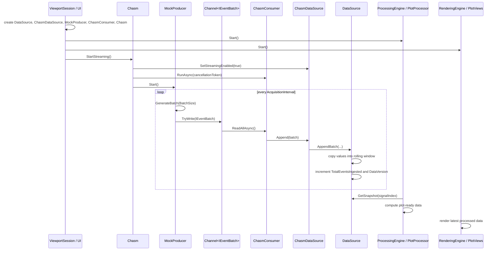
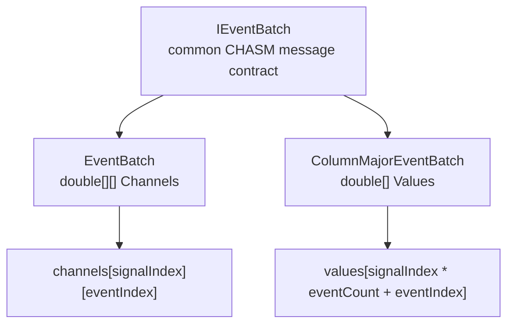
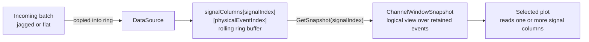

# CHASM Event Pipeline Architecture

This document explains the event pipeline in practical terms: where events are created, how they move through the app, where they live in memory, and how plots read the selected laser/feature/channel.

## Big Picture

```mermaid
flowchart LR
    Producer["MockProducer<br/>creates event batches"]
    EventProducer["EventProducer / IEventIngestionPort<br/>accepts Event objects or flat buffers"]
    EventAdapter["EventBatchConverter&lt;Event&gt;<br/>normalizes DAQ event objects"]
    Channel["Bounded Channel&lt;IEventBatch&gt;<br/>short queue between producer and consumer"]
    Consumer["ChasmConsumer<br/>reads batches asynchronously"]
    Adapter["ChasmDataSource<br/>adapts batch layouts into DataSource writes"]
    Store["DataSource<br/>bounded rolling event window"]
    Processor["PlotProcessor / ProcessingEngine<br/>turns raw events into plot-ready data"]
    Renderer["RenderingEngine + PlotViews<br/>draws histogram, pseudocolor, spectral ribbon, etc."]
    UI["ViewportSession / WPF UI<br/>starts streaming and coordinates updates"]

    UI -->|"start / stop streaming"| Producer
    EventProducer -->|"PublishEvents(IReadOnlyList<Event>)"| EventAdapter
    EventAdapter -->|"ColumnMajorEventBatch"| Channel
    EventProducer -->|"PublishColumnMajor(double[], count)"| Channel
    Producer -->|"TryWrite(batch)"| Channel
    Channel -->|"ReadAllAsync"| Consumer
    Consumer -->|"Append(batch)"| Adapter
    Adapter -->|"AppendBatch(...)"| Store
    Store -->|"GetSnapshot(signalIndex)"| Processor
    Processor -->|"ProcessedPlotData"| Renderer
    Renderer -->|"updated visuals"| UI
```



Think of the pipeline like a factory line.

- `MockProducer` is the machine creating boxes of events.
- `Channel<IEventBatch>` is a small conveyor belt.
- `ChasmConsumer` is the worker taking boxes off the belt.
- `ChasmDataSource` opens the box and knows which memory layout it uses.
- `DataSource` is the warehouse shelf that keeps only the newest events.
- The plot processors read from the shelf and build display data.
- The renderers draw that display data on screen.

## Standard Layer Model

The CHASM names make more sense if every class is assigned to one layer. Do not read `Producer`, `Consumer`, and `Adapter` as equal business concepts; they are different mechanics inside one ingestion pipeline.

| Layer | Responsibility | Current classes | Standard rule |
| --- | --- | --- | --- |
| Ingress source | Creates or receives incoming event batches and puts them on the queue | `MockProducer`, `EventProducer`, `IEventIngestionPort` | This is the only layer that talks to mock generation, DAQ callbacks, or external acquisition APIs. |
| Batch normalization | Converts external/object-shaped data into CHASM batch payloads | `EventBatchConverter<TEvent>`, `Event`, `IEventSignalValues` | External event objects are normalized before they enter the CHASM queue. |
| Queue transport | Buffers batches between acquisition and storage | `Channel<IEventBatch>`, `IEventBatch`, `EventBatch`, `ColumnMajorEventBatch` | The queue carries CHASM batch messages only; it does not know about DAQ SDK objects or retained storage. |
| Queue drain | Reads queued batches asynchronously | `ChasmConsumer`, `IConsumer` | This layer owns the async read loop only. It should not know batch memory layout details. |
| Store append | Interprets CHASM batch payloads and appends them to retained memory | `ChasmDataSource`, `IChasmDataSource` | This is the only crossing point from temporary batch messages into the rolling `DataSource`. |
| Retained store | Owns bounded raw event memory and snapshot access | `DataSource`, snapshots | This is the source of truth for retained events. It should not know mock, DAQ, or SDK types. |

`ChasmPipelineFactory` is the composition layer. It does not process data; it wires one of the supported ingress modes:

```text
CreateMock(...)         -> MockProducer-based CHASM graph
CreateEventIngress(...) -> EventProducer-based CHASM graph + IEventIngestionPort
```

The confusing part is that `EventProducer` is not the same kind of producer as `MockProducer` internally:

- `MockProducer` actively generates data on its own background task.
- `EventProducer` is a push ingress port; another owner calls `PublishEvents(...)` or `PublishColumnMajor(...)`.

They still both belong to the same layer because both feed `Channel<IEventBatch>`. That is the standardization point.

## The Entire Ingestion Pipeline

This is the full story from app startup to pixels on the screen.



### Step 1: `ViewportSession` Wires The System Together

`ViewportSession` is the app-level owner. It builds the objects that need to work together:

```text
ChasmOptions
DataSource
ChasmDataSource
MockProducer
ChasmConsumer
Chasm
PlotProcessor
GateProcessor
ProcessingEngine
RenderingEngine
```

The important part is this relationship:

```text
MockProducer.Reader -> ChasmConsumer -> ChasmDataSource -> DataSource
```

That means the producer does not write into `DataSource` directly. It writes into a channel. The consumer reads from that channel. The adapter writes into `DataSource`.

For real DAQ integration, the equivalent boundary is:

```text
DAQ event-object batch -> EventBatchConverter<TEvent> -> ColumnMajorEventBatch -> Channel<IEventBatch>
```

`EventBatchConverter<TEvent>` is intentionally narrow. It converts event-object batches into CHASM's normalized flat column-major batch shape. It does not own the DAQ SDK, the rolling buffer, processing, or rendering.

This keeps acquisition, queueing, storage, processing, and rendering separate enough to test and profile independently.

### Step 2: Streaming Starts

When the UI turns streaming on, `ViewportSession.SetStreamingEnabled(true)` calls:

```text
Chasm.StartStreaming()
```

`Chasm.StartStreaming()` does three things:

1. Marks streaming as enabled.
2. Starts `ChasmConsumer.RunAsync(...)` on a background task.
3. Starts `MockProducer`.

Order matters here. The consumer starts before the producer so the queue already has a reader when batches begin arriving.

### Step 3: `MockProducer` Creates Batches

`MockProducer` uses `ChasmOptions`:

```text
AcquisitionInterval: 25 ms
BatchSize: 500
ChannelCapacityBatches: 8
WindowCapacityEvents: 200,000
SignalLayout: 1 x 1 x 51 by default
```

Every `AcquisitionInterval`, it creates one batch.

With the default layout:

```text
500 events/batch x 51 signal values/event = 25,500 doubles/batch
```

With a larger layout:

```text
500 events/batch x 3,240 signal values/event = 1,620,000 doubles/batch
```

That larger batch is about:

```text
1,620,000 doubles x 8 bytes = 12.36 MiB per batch
```

So the event shape matters a lot. A `6 x 9 x 60` event is not just 54 times wider than the default; every batch, copy, and retained window scales with that width.

### Step 4: The Channel Is A Short Queue

The producer writes batches to:

```text
Channel<IEventBatch>
```

This channel is bounded. By default, it holds up to `8` batches.

The channel is not the long-term memory store. It is only a short queue between producer and consumer.

Current behavior:

```text
FullMode = DropOldest
SingleWriter = true
SingleReader = true
```

That means:

- There is one producer writing.
- There is one consumer reading.
- If the consumer falls behind and the queue fills, the oldest queued batch can be dropped.
- Dropping from the queue protects the app from unbounded memory growth.

For live acquisition, this is usually better than letting memory grow forever. The tradeoff is that the app may skip event batches if ingestion cannot keep up.

### Step 5: `ChasmConsumer` Reads Batches

`ChasmConsumer` has a simple job:

```text
await foreach batch in reader.ReadAllAsync(token):
    dataSource.Append(batch)
```

It does not know whether a batch is jagged or flat. It only knows the batch implements `IEventBatch`.

That is intentional. The consumer owns async queue reading, not memory-layout decisions.

### Step 6: `ChasmDataSource` Chooses The Append Path

`ChasmDataSource` is the adapter between CHASM messages and `DataSource` storage.

It receives:

```text
IEventBatch batch
```

Then it checks the concrete type:

```text
EventBatch              -> DataSource.AppendBatch(double[][], count)
ColumnMajorEventBatch   -> DataSource.AppendBatch(ColumnMajorEventBatch)
Unsupported batch type  -> throw NotSupportedException
```

This is where memory layout knowledge belongs. The consumer should not care. The producer should not know about the retained ring buffer. `ChasmDataSource` is the crossing point between temporary incoming batches and permanent retained storage.

### Step 7: `DataSource` Copies Into The Rolling Window

`DataSource` owns the retained raw-event window.

It stores data like this:

```text
signalColumns[signalIndex][physicalEventIndex]
```

So for each signal column, it has an array of retained event values.

When a batch arrives, `DataSource`:

1. Checks that the incoming signal count matches its configured `SignalLayout`.
2. Checks that the incoming batch length matches the event count.
3. Figures out how much of the batch can fit in the rolling window.
4. Copies each signal column into the ring buffer.
5. Advances `_writeIndex`.
6. Updates `_count`.
7. Adds to `_totalEventsIngested`.
8. Increments `_dataVersion`.

The ring buffer part means memory does not grow forever. If the window capacity is `200,000`, only the newest `200,000` events are retained.

### Step 8: `DataVersion` Tells Processing That New Data Exists

`ProcessingEngine` does not need to know every batch. It needs to know whether the retained data changed.

That is what `DataVersion` is for.

Every successful append increments `DataVersion`. `ProcessingEngine` watches that value. When it changes, plot processing can run against the latest retained window.

That is the bridge from ingestion to plotting:

```text
append batch -> DataVersion changes -> processing wakes up -> plots get new processed data
```

### Step 9: Plots Read Snapshots, Not Producer Batches

Plots do not read directly from `MockProducer`.

Plots read from `DataSource` snapshots:

```text
GetSnapshot(signalIndex)
GetSnapshot(signalIndexA, signalIndexB, ...)
```

The snapshot says:

```text
Here is the retained array.
Here is where the logical window starts.
Here is how many events are valid.
Here is the sequence range.
Here is the data version.
```

This matters because the physical array is a ring. The newest logical events may wrap around the end of the array. The snapshot tells processors how to interpret the physical memory as a logical event window.

### Step 10: Rendering Uses Processed Data

`PlotProcessor` turns raw event snapshots into plot-ready structures:

```text
HistogramProcessedData
HeatmapProcessedData
SpectralRibbonProcessedData
```

`RenderingEngine` then pushes that processed data into the WPF plot views.

So rendering is downstream of ingestion. Rendering should not care whether a batch originally came from jagged arrays or a flat array.

## Event Shape

An event is not just one number. It can have many signal values.

For the larger shape we discussed:

```text
6 lasers x 9 features x 60 channels = 3,240 signal values per event
```

The app uses `SignalLayout` to map a selected laser, feature, and channel into one signal column:

```text
signalIndex = ((laser * featureCount) + feature) * channelCount + channel
```

Example:

```text
SignalLayout(6, 9, 60).ToIndex(2, 4, 17) = 1337
```

So if a plot selects:

```text
Laser 2, Feature 4, Channel 17
```

the plot does not scan the whole 3,240-signal event. It reads signal column `1337`.

## Batch Layouts

The pipeline now supports two batch memory layouts behind the same `IEventBatch` boundary.



### Jagged Batch

The older layout is:

```text
channels[signalIndex][eventIndex]
```

For `6 x 9 x 60`, one batch has:

```text
1 outer double[][]
3,240 inner double[] arrays
```

That is easy to read, but expensive to allocate repeatedly.

### Flat Column-Major Batch

The optimized layout is:

```text
values[signalIndex * eventCount + eventIndex]
```

For the same `6 x 9 x 60` shape, one batch has:

```text
1 double[] array
```

This is better for throughput because the runtime allocates one large block instead of thousands of smaller arrays.

## Where Data Lives Long Term

`DataSource` is still the main in-memory store for retained raw events.



Important point: batches are temporary. `DataSource` is the retained window.

When a batch arrives:

1. `DataSource` validates the signal count and event count.
2. It copies the batch into its fixed-capacity ring buffer.
3. If the window is full, the oldest events are overwritten.
4. It increments `TotalEventsIngested` and `DataVersion`.
5. Plots later read snapshots from the retained window.

## Why `IEventBatch` Exists

`IEventBatch` is deliberately small:

```csharp
public interface IEventBatch
{
    int Count { get; }
    int SignalCount { get; }
}
```

It exists so the CHASM queue and consumer do not care about memory layout.

That gives us this ownership split:

- `ChasmConsumer` owns async reading from the channel.
- `ChasmDataSource` owns choosing the correct append path for each batch type.
- `DataSource` owns retained raw-event memory and rolling-window invariants.
- `EventBatch` and `ColumnMajorEventBatch` own only temporary batch payload shape.

This is the useful amount of abstraction here. Adding a large hierarchy would make the code harder to read. Keeping `IEventBatch` tiny gives us one real benefit: the pipeline can carry multiple memory layouts without duplicating the consumer.

## Correctness Rules

These are the invariants the design must protect.

| Invariant | Owner |
| --- | --- |
| A batch cannot claim the wrong signal count | `EventBatch`, `ColumnMajorEventBatch`, `DataSource` |
| A batch cannot claim the wrong event count | `EventBatch`, `ColumnMajorEventBatch`, `DataSource` |
| Retained memory stays bounded | `DataSource` |
| Old events are overwritten only by the rolling-window rule | `DataSource` |
| Plot snapshots describe the current retained logical window | `DataSource` |
| The consumer does not need to know batch memory layout | `ChasmConsumer`, `IEventBatch` |
| Unsupported batch layouts fail clearly | `ChasmDataSource` |

## Snapshot Contract

`DataSource` supports two snapshot styles:

```text
GetSnapshot(...)      -> live ring-buffer view
GetSnapshotCopy(...)  -> stable contiguous copy
```

The live snapshot path is the default hot path for plot processors. It avoids allocations and lets histogram, pseudocolor, and spectral processing read selected columns directly from retained memory. The tradeoff is that the backing arrays can be updated by later ingestion while a processor is scanning them.

The copied snapshot path exists for correctness-sensitive boundaries. It copies the selected logical window into new arrays, sets `StartIndex = 0`, and remains stable after later appends. It is cheap for one or two selected signals, but expensive for wide selections such as spectral ribbon copies over 42 signals.

## Event Object Conversion

If a DAQ API provides batches of event objects, CHASM should not make `DataSource` understand that DAQ-specific object model. Instead, convert the object batch at the ingestion edge:

```text
IReadOnlyList<Event>
    -> IEventIngestionPort.PublishEvents(...)
    -> EventBatchConverter<Event>
    -> ColumnMajorEventBatch
    -> Channel<IEventBatch>
```

If the DAQ can already provide a flat column-major payload, use the faster direct path:

```text
double[] values + eventCount
    -> IEventIngestionPort.PublishColumnMajor(...)
    -> ColumnMajorEventBatch
    -> Channel<IEventBatch>
```

The converter writes:

```text
values[signalIndex * eventCount + eventIndex]
```

For `Event` objects, the converter validates that each event has the expected `SignalLayout.SignalCount` before writing the output batch. Large conversions use a parallel signal-first path, while small conversions stay single-threaded to avoid scheduling overhead.

`EventProducer` is intentionally a push boundary. It does not synthesize data like `MockProducer`; a DAQ callback or SDK adapter can call `PublishEvents(...)` with object batches or `PublishColumnMajor(...)` with flat buffers. The direct flat path avoids object conversion when the real DAQ can provide CHASM's preferred memory layout.

`PublishColumnMajor(...)` is a no-copy path. The caller should treat the published `double[]` as transferred to CHASM and must not mutate or reuse it while the batch may still be queued or consumed.

## Why The Flat Path Is Faster

The flat path is faster mainly because it reduces allocation pressure.

For a `6 x 9 x 60` batch:

```text
jagged layout: 3,241 arrays per batch
flat layout:       1 array per batch
```

The CPU still has to copy the same amount of raw numeric data into `DataSource`, but the garbage collector has much less object bookkeeping to deal with.

Recent profile runs showed this clearly. Machine-specific numbers vary, but the shape is useful:

```text
Event object conversion path:
1x1x51 convert+append:   about 900,840 events/sec
6x9x50 convert+append:   about 50,769 events/sec
6x9x60 convert+append:   about 39,060 events/sec

EventProducer publish path:
1x1x51 publish:          about 946,396 events/sec
6x9x50 publish:          about 109,286 events/sec
6x9x60 publish:          about 90,025 events/sec

Flat prebuilt CHASM path:
6x9x50 no-drop capture: about 269,743 events/sec
6x9x60 no-drop capture: about 140,938 events/sec
```

Those numbers are machine-specific, but the reason is structural: fewer allocations, fewer objects, and a more compact batch representation.

## Current Design Tradeoff

The pipeline now accepts flat batches, but `DataSource` still stores retained data as:

```text
signalColumns[signalIndex][eventIndex]
```

That is acceptable right now because plots usually ask for selected signal columns. A histogram for one selected laser/feature/channel can read one column directly.

The next major optimization would be deciding whether `DataSource` itself should also move from many `double[]` columns to one flat retained buffer. That is a larger change because snapshots, resizing, and plot processors all depend on the current column-array shape.

## Mental Model

For now, use this model:

```text
IEventBatch = delivery box
ColumnMajorEventBatch = faster box shape
ChasmConsumer = delivery worker
ChasmDataSource = unpacking station
DataSource = rolling warehouse shelf
SignalLayout = address book for Laser/Feature/Channel
PlotProcessor = math worker
RenderingEngine = drawing worker
```

The most important idea is that Laser/Feature/Channel selection becomes an address lookup. Once `SignalLayout` gives the `signalIndex`, the plot can read that signal column directly from the retained event window.

## Threading And Ownership

There are several loops running at the same time:

| Loop | Owner | Job |
| --- | --- | --- |
| UI thread | WPF / `ViewportSession` | handles user actions and visual updates |
| Producer task | `MockProducer` | creates batches on a timer |
| Consumer task | `ChasmConsumer` | drains the channel and appends to `DataSource` |
| Processing timer | `ProcessingEngine` | recomputes plot data when `DataVersion` changes |
| Rendering timer | `RenderingEngine` | pushes processed data into plot views |

The main shared object is `DataSource`.

`DataSource` protects its mutable state with a lock:

```text
_channels
_writeIndex
_count
_totalEventsIngested
_dataVersion
_windowCapacity
```

That lock is important because ingestion can append while processing asks for snapshots or the UI changes the window capacity.

## What Happens When Things Go Wrong

### Producer Is Faster Than Consumer

If producer speed exceeds consumer speed, the channel can fill.

Because the channel uses `DropOldest`, the app drops old queued batches instead of growing memory forever.

Result:

```text
memory stays bounded
newer data is favored
some event history may be skipped
```

### Batch Shape Is Wrong

If a batch says it has the wrong number of signals or values, construction or append validation fails.

That is better than silently corrupting the event window.

### Streaming Stops

When streaming stops:

1. `Chasm.StopStreaming()` marks streaming disabled.
2. The producer is stopped.
3. The consumer cancellation token is cancelled.
4. Queued batches are drained so restart does not replay stale data.

Stopping streaming does not automatically clear retained data. It stops new ingestion. The current rolling window remains available for plots until the user clears memory or new data overwrites it later.

### Memory Is Cleared

When memory is cleared:

1. `Chasm.ClearMemory()` calls `DataSource.ClearMemory()`.
2. `DataSource` clears retained arrays and resets count/write state.
3. `ProcessingEngine.OnDataCleared()` resets processing state.
4. The UI is notified so visuals can clear immediately.

## How To Read The Pipeline In Code

Start here:

1. `Worksheet.App/Services/Viewport/ViewportSession.cs`
   - Builds the whole runtime graph.
   - Starts/stops CHASM, processing, and rendering.
2. `Worksheet.Core/Services/CHASM/Chasm.cs`
   - Owns streaming lifecycle.
   - Starts producer and consumer.
3. `Worksheet.Core/Services/CHASM/MockProducer.cs`
   - Creates event batches.
   - Writes them into `Channel<IEventBatch>`.
4. `Worksheet.Core/Services/CHASM/ChasmConsumer.cs`
   - Reads from the channel.
   - Calls append on the data source adapter.
5. `Worksheet.Core/Services/CHASM/ChasmDataSource.cs`
   - Chooses jagged vs flat append path.
6. `Worksheet.Core/Services/Viewport/DataSource.cs`
   - Owns the rolling raw-event window.
   - Serves snapshots to processors.
7. `Worksheet.Core/Models/SignalLayout.cs`
   - Maps Laser/Feature/Channel into a signal index.

If you understand those files in that order, you understand ingestion.
