# Ingestion, Processing, Rendering, And Blitting Pipeline

This document explains how data moves through Worksheet from acquisition to pixels on screen. It is written for a technical reader with a college-level software or engineering background, but it avoids assuming deep knowledge of WPF, ScottPlot, or flow-cytometry acquisition systems.

The short version:

```text
DAQ or mock data
  -> CHASM ingestion queue
  -> rolling raw event buffer
  -> plot processors
  -> processed plot data
  -> rendering engine
  -> ScottPlot axes plus bitmap/signal drawing
  -> WPF screen pixels
```

Worksheet has two related data streams:

- Parameter events: flattened numeric values shaped by `SignalLayout`, used by histograms, pseudocolor plots, spectral ribbon plots, and gates.
- Analog captures: waveform samples shaped as `[analog channel, timestamp]`, used by oscilloscope plots.

The important design idea is that parameter events are retained in a bounded rolling window, while oscilloscope waveforms are transient. The app keeps the newest waveform captures only long enough for the oscilloscope to draw them.

## Big Picture

```mermaid
flowchart LR
    Daq["DAQ adapter or MockProducer"]
    EventProducer["EventProducer / IEventIngestionPort"]
    Converter["EventBatchConverter"]
    Queue["Channel<IEventBatch>"]
    Consumer["ChasmConsumer"]
    ChasmSource["ChasmDataSource"]
    DataSource["DataSource<br/>rolling raw event window"]
    Processing["ProcessingEngine"]
    PlotProcessor["PlotProcessor"]
    ScopeProcessor["OscilloscopePlotProcessor"]
    DataStore["DataStore<br/>settings + processed data"]
    Rendering["RenderingEngine"]
    PlotViews["PlotViews"]
    Bitmap["DynamicBitmap / WriteableBitmap"]
    ScopeBuffer["OscilloscopeBuffer"]

    Daq -->|"Event objects"| EventProducer
    Daq -->|"flat column-major buffer"| EventProducer
    EventProducer -->|"Event.Parameters"| Converter
    Converter -->|"ColumnMajorEventBatch"| Queue
    EventProducer -->|"PublishColumnMajor"| Queue
    Daq -->|"Event.AnalogCapture"| ScopeBuffer
    Daq -->|"mock AnalogCapture"| ScopeBuffer

    Queue --> Consumer
    Consumer --> ChasmSource
    ChasmSource --> DataSource
    DataSource --> Processing
    ScopeBuffer --> ScopeProcessor
    Processing --> PlotProcessor
    PlotProcessor --> DataStore
    ScopeProcessor --> DataStore
    DataStore --> Rendering
    Rendering --> PlotViews
    PlotViews --> Bitmap
```



## Main Ownership Model

| Layer | Main classes | Owns | Does not own |
| --- | --- | --- | --- |
| App orchestration | `ViewportSession` | Object graph, start/stop, memory clear, status snapshots | Numeric plot algorithms |
| Ingestion lifecycle | `Chasm` | Producer start/stop and consumer loop lifetime | Plot processing or rendering |
| Acquisition inputs | `MockProducer`, `EventProducer`, `IEventIngestionPort` | Creating or receiving incoming event batches | Retained event memory |
| Batch conversion | `EventBatchConverter` | `Event.Parameters` to `ColumnMajorEventBatch` | Waveforms, rendering, rolling storage |
| Queue transport | `Channel<IEventBatch>` | Short bounded queue between producer and consumer | Long-term storage |
| Batch-to-store adapter | `ChasmDataSource` | Interpreting batch memory layout and appending to `DataSource` | Producing events |
| Retained raw storage | `DataSource` | Fixed-size rolling event window and snapshots | DAQ SDK shape or WPF drawing |
| Plot processing | `ProcessingEngine`, `PlotProcessor`, `GateProcessor`, `OscilloscopePlotProcessor` | Turning raw data into plot-ready objects | UI drawing |
| Processed data store | `DataStore` | Latest settings, processed plot data, render target sizes, gates | Heavy math or WPF rendering |
| Rendering | `RenderingEngine`, `PlotView` subclasses | UI-thread drawing and render timing | Ingestion |
| Bitmap presentation | `DynamicBitmap` | `WriteableBitmap.WritePixels(...)` blitting into WPF image | Axis computation |

This separation keeps the hot path understandable:

- CHASM moves and stores raw numeric events.
- Processors build display data.
- Renderers draw the latest display data.

## Event Shape And Signal Addresses

An event can contain many values. Worksheet describes that shape with `SignalLayout`.

The default connected-channel shape is:

```text
1 laser x 1 feature x 51 channels = 51 signal values per event
```

A larger shape could be:

```text
6 lasers x 9 features x 60 channels = 3,240 signal values per event
```

`SignalLayout` maps a selected laser, feature, and channel into one flat signal index:

```text
signalIndex = ((laser * featureCount) + feature) * channelCount + channel
```

That means plots do not need to scan every value in a wide event. If a plot needs one selected laser/feature/channel, it asks `DataSource` for that one signal column.

## Parameter Event Ingestion

Parameter events are the values used by the non-oscilloscope plots.

There are two supported ingress shapes.

### Object Event Input

Use this when the DAQ gives the app event objects:

```text
IReadOnlyList<Event>
  -> EventProducer.PublishEvents(...)
  -> EventBatchConverter.Convert(...)
  -> ColumnMajorEventBatch
  -> Channel<IEventBatch>
```

`Event` contains:

```text
Event.Parameters    flattened [laser, feature, channel] values
Event.AnalogCapture waveform samples that produced those parameters
```

`EventBatchConverter` reads only `Event.Parameters`. It validates that every event has the expected number of signal values, then writes the output in column-major order:

```text
values[signalIndex * eventCount + eventIndex]
```

### Flat Column-Major Input

Use this when the DAQ or adapter can already provide the preferred layout:

```text
double[] values + eventCount
  -> EventProducer.PublishColumnMajor(...)
  -> ColumnMajorEventBatch
  -> Channel<IEventBatch>
```

This is the fastest path because it avoids object-event conversion. The caller should treat the `double[]` as transferred to CHASM and should not mutate or reuse it while it may still be queued.

## Temporary Batch Layouts

The queue carries `IEventBatch`. There are two concrete batch layouts:

| Batch type | Memory shape | Why it exists |
| --- | --- | --- |
| `EventBatch` | `double[][] channels`, shaped as `channels[signalIndex][eventIndex]` | Simple, readable older format |
| `ColumnMajorEventBatch` | `double[] values`, shaped as `values[signalIndex * eventCount + eventIndex]` | Faster, flatter format with fewer allocations |

For a large `6 x 9 x 60` event shape and a `500` event batch:

```text
signals/event = 3,240
values/batch = 3,240 x 500 = 1,620,000 doubles
payload size = 1,620,000 x 8 bytes = about 12.36 MiB
```

With a jagged batch, that can mean thousands of arrays per batch. With a flat column-major batch, it is one array.

## CHASM Queue And Streaming Lifecycle

`Chasm` owns the streaming lifecycle:

```text
StartStreaming()
  -> mark DataSource streaming enabled
  -> start ChasmConsumer
  -> start producer

StopStreaming()
  -> stop producer
  -> cancel consumer
  -> mark DataSource streaming disabled
```

The producer writes to a bounded `Channel<IEventBatch>`. The channel is a short queue, not long-term storage. If ingestion produces faster than the consumer can append, the bounded channel protects memory from growing forever.

The consumer path is intentionally simple:

```text
ChasmConsumer
  -> read IEventBatch from Channel<IEventBatch>
  -> ChasmDataSource.Append(batch)
```

`ChasmDataSource` is where batch layout becomes storage writes:

```text
EventBatch
  -> DataSource.AppendBatch(double[][], count)

ColumnMajorEventBatch
  -> DataSource.AppendBatch(ColumnMajorEventBatch)
```

## DataSource: The Rolling Raw Event Window

`DataSource` is the source of truth for retained parameter events.

Internally it stores columns:

```text
_channels[signalIndex][physicalEventIndex]
```

This is a ring buffer. It has a fixed capacity. When new events arrive and the window is full, the oldest events are overwritten.

When appending a batch, `DataSource`:

1. Validates the incoming signal count and event count.
2. Drops the oldest part of the incoming batch if the batch itself is larger than the window.
3. Copies retained values into the ring buffer.
4. Advances the write index.
5. Updates buffered count.
6. Increments total event count.
7. Increments `DataVersion`.

`DataVersion` is how downstream processing knows raw retained data changed.

## Snapshots: How Plots Read Raw Data

Processors do not read from producers. They read snapshots from `DataSource`.

Two snapshot styles exist:

```text
GetSnapshot(...)      live ring-buffer view
GetSnapshotCopy(...)  stable contiguous copy
```

The live snapshot is fast because it returns references to the retained arrays plus metadata:

```text
Values
StartIndex
Count
Capacity
Version
StartSequence
EndSequence
```

The processor uses that metadata to read the logical event window even if the physical ring wraps around the end of the array.

The copied snapshot is safer across isolation boundaries because it returns a new contiguous array. It costs more memory bandwidth, especially for wide selections such as spectral ribbon.

## Oscilloscope Waveform Stream

Oscilloscope data is intentionally not stored in `DataSource`.

Reason: waveforms are large and short-lived. The user usually wants the latest waveform at display cadence, not a retained history of every waveform.

The waveform path is:

```text
Event.AnalogCapture or MockProducer synthetic capture
  -> IAnalogCaptureSink.Publish(...)
  -> OscilloscopeBuffer
  -> OscilloscopePlotProcessor
  -> OscilloscopeProcessedData
  -> OscilloscopePlotView
```

`AnalogCapture` is shaped as:

```text
values[channelIndex * timestampCount + timestampIndex]
```

`OscilloscopeBuffer` keeps a bounded queue of recent captures and exposes a `Version`. When the oscilloscope processor runs, it drains older captures and uses the newest available capture. This favors current display over old waveform history.

Channel selection lives in:

```text
PlotSettings.OscilloscopeChannelIndices
```

The processor extracts every valid selected channel into:

```text
OscilloscopeProcessedData.Signals[channelSelectionIndex][timestampIndex]
```

The oscilloscope plot draws those as ScottPlot signal plottables. It does not use the bitmap blitting path.

## Plot Processing

`ProcessingEngine` is the scheduler for plot computation.

On each processing tick it:

1. Reads all active `PlotSettings` from `DataStore`.
2. Looks up the processing pipeline for each plot type.
3. Builds a fingerprint from plot settings, render target size, and data version.
4. Skips work if nothing relevant changed.
5. Runs the correct processor when work is due.
6. Stores the result in `DataStore.SetProcessedData(...)`.

Parameter plots use `PlotProcessor`:

| Plot type | Input | Output |
| --- | --- | --- |
| Histogram | one selected signal snapshot | `HistogramProcessedData` |
| Pseudocolor | two selected signal snapshots | `HeatmapProcessedData` |
| Spectral ribbon | many wavelength channel snapshots | `SpectralRibbonProcessedData` |

Oscilloscope plots use `OscilloscopePlotProcessor` and key off `OscilloscopeBuffer.Version`, not CHASM `DataVersion`.

## Incremental Processing

`PlotProcessor` keeps per-plot state so it does not have to rebuild from the full rolling window every tick.

Examples:

- Histograms keep bin counts and per-event bin contribution history.
- Pseudocolor keeps heatmap bin counts, normalized data, and pixel buffers.
- Spectral ribbon keeps channel/bin counts, normalized data, and pixel buffers.

If new data arrives in sequence, processors can apply only the delta. If settings change, the window is resized, or the sequence has a gap, processing can fall back to a full rebuild.

## DataStore: The Handoff Between Processing And Rendering

`DataStore` is the shared model between processing and rendering. It stores:

- plot settings
- render target sizes
- latest `ProcessedPlotData` per plot
- gate settings
- latest gate results

Processing writes:

```text
DataStore.SetProcessedData(processed)
```

Rendering reads:

```text
DataStore.TryGetProcessedData(plotId, out data)
```

That separation matters because processing does not directly touch WPF controls, and rendering does not directly scan raw event buffers.

## Rendering Engine

`RenderingEngine` owns UI-thread render scheduling.

On each render tick it:

1. Takes a snapshot of registered render targets.
2. Reads latest processed data from `DataStore`.
3. Skips a target if it already rendered that exact processed data object.
4. Adds changed plots to a pending render dictionary.
5. Schedules one WPF dispatcher render pass.

The render pass runs on the UI thread:

```text
Dispatcher.BeginInvoke(DispatcherPriority.Render, RenderPendingOnUiThread)
```

Inside the render pass:

```text
PlotView.Render(WpfPlot plot, ProcessedPlotData data)
```

is called for each pending plot.

This coalesces multiple plot updates into one UI-thread pass and avoids directly rendering from background processing code.

## Static ScottPlot Layer vs Dynamic Data Layer

Worksheet uses ScottPlot for plot chrome:

- axes
- labels
- ticks
- borders
- static layout
- signal plottables for oscilloscope

For dense parameter plots, the high-frequency data layer is often a bitmap drawn on top of the ScottPlot data rectangle.

The split looks like this:

```text
ScottPlot WpfPlot
  -> axis and border layer
  -> data rectangle coordinates

DynamicBitmap
  -> WPF Image aligned to ScottPlot data rectangle
  -> pixel buffer presented with WriteableBitmap.WritePixels(...)
```

`PlotView.AttachBitmapSurface(...)` listens for ScottPlot render and size changes. After ScottPlot knows its data rectangle, the view converts that rectangle from physical pixels to WPF device-independent pixels and positions the `DynamicBitmap` over the plot's data area.

## Blitting Path

Blitting here means copying a prepared pixel buffer into a WPF bitmap for display.

For pseudocolor and spectral ribbon:

```text
PlotProcessor
  -> compute normalized bin data
  -> write BGRA pixels into byte[] PixelBuffer
  -> HeatmapProcessedData or SpectralRibbonProcessedData
  -> PlotView.Render(...)
  -> DynamicBitmap.PresentBitmap(buffer, width, height)
  -> WriteableBitmap.WritePixels(...)
  -> WPF Image displays it
```

`DynamicBitmap.PresentBitmap(...)` creates or reuses a `WriteableBitmap` with the requested pixel size, then writes the full pixel buffer:

```text
_bitmap.WritePixels(new Int32Rect(0, 0, width, height), buffer, stride, 0)
```

The buffer is BGRA32:

```text
4 bytes per pixel
stride = width * 4
```

This is faster and more predictable than asking ScottPlot to rebuild a dense heatmap object for every frame. ScottPlot still supplies the coordinate system and visual frame.

## Render Paths By Plot Type

| Plot type | Processing output | Render path |
| --- | --- | --- |
| Histogram | `HistogramProcessedData` | App rasterizes green histogram bars into a bitmap and blits through `DynamicBitmap` |
| Pseudocolor | `HeatmapProcessedData` | Processor prepares colored pixel buffer; view blits through `DynamicBitmap` |
| Spectral ribbon | `SpectralRibbonProcessedData` | Processor prepares colored pixel buffer; view blits through `DynamicBitmap` |
| Oscilloscope | `OscilloscopeProcessedData` | View clears/adds ScottPlot signal plottables and refreshes |

The histogram path still computes its final pixel buffer in the WPF view because its dynamic scale and bars are tightly tied to the current plotted height. Pseudocolor and spectral ribbon receive already-colored pixel buffers from `PlotProcessor`.

## DPI And Target Size

WPF measures layout in device-independent pixels, while bitmap rendering needs physical pixels.

The path is:

```text
ScottPlot LastRender.DataRect
  -> DpiContext
  -> DynamicBitmap.SetDataRect(...)
  -> TargetSizeChanged(plotId, RenderTargetSize)
  -> DataStore.SetRenderTargetSize(...)
  -> ProcessingEngine uses target size in settings fingerprint
  -> PlotProcessor creates pixel buffer at matching size
```

This prevents a dense plot from rendering a tiny buffer and stretching it badly on high-DPI screens.

## Gates

Gates are processed separately from plot rendering.

The path is:

```text
GateVisualManager
  -> GateSettings
  -> DataStore.UpsertGate(...)
  -> ProcessingEngine.ProcessGates(...)
  -> GateProcessor
  -> DataStore.SetGateResult(...)
  -> Sidebar statistics
```

Gate processing reads the same retained `DataSource` snapshots as plots. Gate results are keyed by gate geometry, plot settings, and data version so unchanged gates can be skipped.

## Timing And Metrics

The status panel reports:

- event rate
- buffered event count
- average compute time by plot type
- average render time by plot type
- incremental processing stats

The event rate is sampled from `DataSource.TotalEventsIngested`. Compute timing is measured in `ProcessingEngine`; render timing is measured in `RenderingEngine`.

These are useful averages for development and quick comparisons. They are not full latency distributions.

## Failure And Backpressure Behavior

| Situation | Behavior |
| --- | --- |
| Producer is faster than consumer | Bounded channel prevents unlimited queue growth; older queued batches may be dropped depending on channel mode |
| Rolling window fills | `DataSource` overwrites the oldest retained events |
| Batch shape is wrong | Batch constructors or `DataSource` validation throw instead of corrupting memory |
| Streaming stops | Producer stops, consumer is cancelled, retained memory remains available |
| Memory is cleared | `DataSource` clears retained data, processing state resets, UI plot visuals are cleared |
| Oscilloscope falls behind | `OscilloscopeBuffer` drops old captures and processor uses the newest capture |

## How To Read The Code

For ingestion:

1. `Worksheet.App/Services/Viewport/ViewportSession.cs`
2. `Worksheet.Core/Services/CHASM/ChasmPipelineFactory.cs`
3. `Worksheet.Core/Services/CHASM/Chasm.cs`
4. `Worksheet.Core/Services/CHASM/MockProducer.cs` or `EventProducer.cs`
5. `Worksheet.Core/Services/CHASM/EventBatchConverter.cs`
6. `Worksheet.Core/Services/CHASM/ChasmConsumer.cs`
7. `Worksheet.Core/Services/CHASM/ChasmDataSource.cs`
8. `Worksheet.Core/Services/Viewport/DataSource.cs`

For plot processing:

1. `Worksheet.Core/Services/Viewport/ProcessingEngine.cs`
2. `Worksheet.Core/Services/Viewport/PlotPipelineRegistry.cs`
3. `Worksheet.Core/Services/Viewport/ParameterPlotPipeline.cs`
4. `Worksheet.Core/Services/Viewport/OscilloscopePlotPipeline.cs`
5. `Worksheet.Core/Services/Viewport/PlotProcessor.cs`
6. `Worksheet.Core/Services/Viewport/OscilloscopePlotProcessor.cs`
7. `Worksheet.Core/Services/Viewport/Gates/GateProcessor.cs`

For rendering and blitting:

1. `Worksheet.App/Services/Viewport/RenderingEngine.cs`
2. `Worksheet.App/Views/PlotViews/PlotView.cs`
3. `Worksheet.App/Views/Support/PlotContainerFactory.cs`
4. `Worksheet.App/Views/Surfaces/DynamicBitmap.cs`
5. `Worksheet.App/Views/PlotViews/HistogramPlotView.cs`
6. `Worksheet.App/Views/PlotViews/PseudocolorPlotView.cs`
7. `Worksheet.App/Views/PlotViews/SpectralRibbonPlotView.cs`
8. `Worksheet.App/Views/PlotViews/OscilloscopePlotView.cs`

## Mental Model

Use this model when explaining the system:

```text
CHASM is the loading dock.
DataSource is the rolling warehouse shelf.
ProcessingEngine is the scheduler deciding which plots need new prepared data.
PlotProcessor is the math worker.
DataStore is the handoff table between math and drawing.
RenderingEngine is the UI-thread dispatcher.
DynamicBitmap is the fast image layer that blits prepared pixels into WPF.
ScottPlot is the plot frame, axes, and oscilloscope signal drawer.
```

The design goal is not to make every layer generic. The goal is to keep the expensive work off the UI thread, keep memory bounded, and let each plot read only the signal columns it actually needs.
